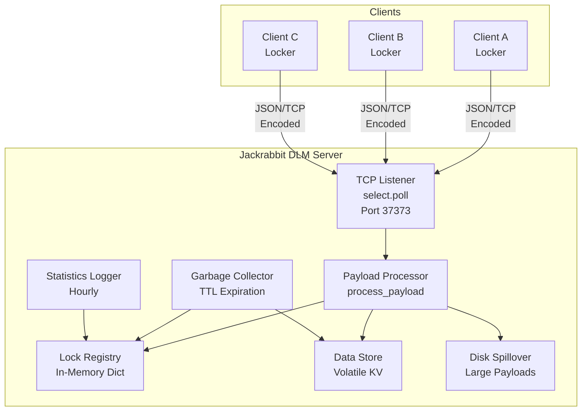
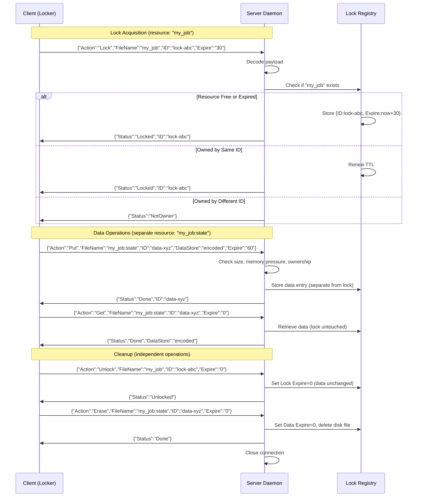
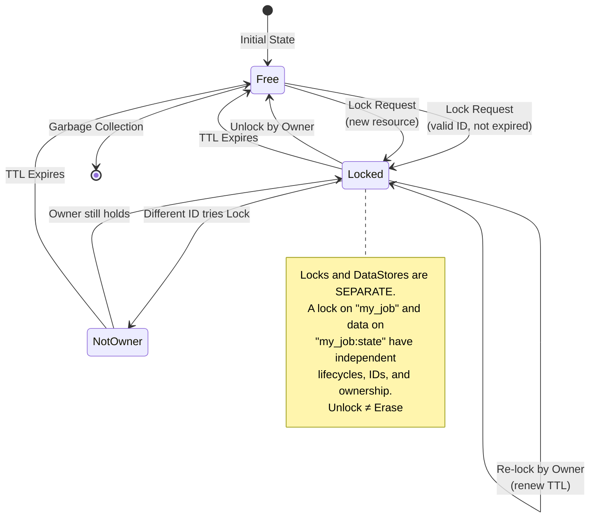
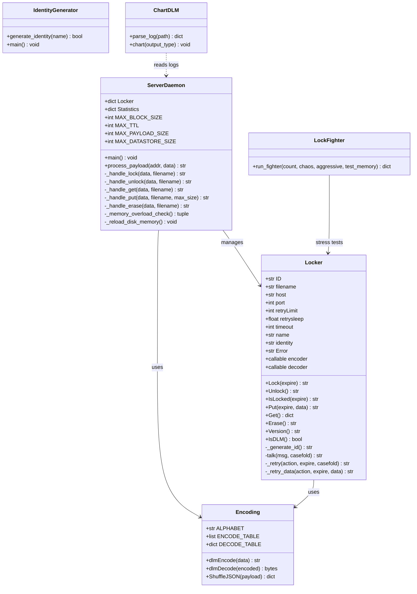

# Jackrabbit DLM

**High-Performance Distributed Lock Manager & Volatile State Coordinator**

```
       __           __              __    __    _ __     ____  __    __  ___
      / /___ ______/ /___________ _/ /_  / /_  (_) /_   / __ \/ /   /  |/  /
 __  / / __ `/ ___/ //_/ ___/ __ `/ __ \/ __ \/ / __/  / / / / /   / /|_/ /
/ /_/ / /_/ / /__/ ,< / /  / /_/ / /_/ / /_/ / / /_   / /_/ / /___/ /  / /
\____/\__,_/\___/_/|_/_/   \__,_/_.__/_.___/_/\__/  /_____/_____/_/  /_/

    ____  __    __  ___
   / __ \/ /   /  |/  /
  / / / / /   / /|_/ /
 / /_/ / /___/ /  / /
/_____/_____/_/  /_/
```

> *High-Performance Distributed Lock Manager & Volatile State Coordinator*
> Zero dependencies. Pure Python. Blind Vault architecture.

---

## TL;DR

**What it does:** Multiple programs across different machines need to coordinate access to shared resources (files, counters, configs). Jackrabbit DLM is a tiny server they all talk to -- it grants **advisory locks** ("I'm using this, hands off") and stores **small bits of shared state** ("the counter is at 47"), then auto-releases everything after a timeout.

**How it works:** The server listens on a TCP port. Clients send JSON commands over the wire. The server tracks who owns what, enforces ownership (no hijacking), and expires stale entries. Data is encoded before hitting the network -- the server never sees plain text.

**Why not Redis/ZooKeeper/Etcd?** Those are great but heavy. Redis logs your data in plain text. ZooKeeper needs a JVM. This is a single Python file with one dependency (`psutil`) that you can read in 20 minutes and trust completely because you can see every line.

**Getting started:**
```bash
# Install
./scripts/install.sh

# Start server
python3 -m jackrabbitdlm.server.daemon

# Use from Python
from jackrabbitdlm import Locker
lock = Locker("my_resource", Host="127.0.0.1", Port=37373)
if lock.Lock(expire=30) == 'locked':
    try:
        lock.Put(data="hello", expire=60)
        print(lock.Get())
    finally:
        lock.Unlock()
```

---

## Table of Contents

- [Architecture](#architecture)
- [Components](#components)
- [Protocol Reference](#protocol-reference)
- [Installation](#installation)
- [Usage Examples](#usage-examples)
- [Security Model](#security-model)
- [Performance & Monitoring](#performance--monitoring)
- [Comparison with Alternatives](#comparison-with-alternatives)
- [Project Structure](#project-structure)
- [Stress Testing](#stress-testing)
- [Deeper Concepts](#deeper-concepts)
- [License](#license)

---

## Architecture

Jackrabbit DLM uses a **client-server** model over TCP. The server is a single-process event loop using `select.poll()` for non-blocking I/O, handling hundreds of concurrent connections without threads.

### High-Level Overview



### Request Flow (Sequence)

**Important:** Locks and DataStores are separate entities with separate IDs.
Use different `FileName` values for locks vs data (e.g. `"my_job"` for the lock,
`"my_job:state"` for data). Unlocking does NOT erase data, and erasing does NOT unlock.



### Lock State Machine



### Data Flow (Put with Disk Spillover)

**Critical:** At 33% RAM saturation, BOTH Lock and Put operations are disabled
(server returns `NO`). Only Get, Unlock, and Erase continue working.

Disk spillover threshold is **dynamic** -- starts at 16KB but drops to ~8KB
under memory pressure. Three conditions trigger disk writes:

```mermaid
flowchart TD
    A[Client Request] --> OP{Operation Type}
    
    OP -->|"Lock / Put"| B{Memory Check}
    OP -->|"Get / Unlock / Erase"| PROCESS[Process Normally]
    
    B -->|RAM ≥ 33%| C[Return NO<br/>⛔ Memory Overloaded]
    B -->|RAM < 33%| D{Request: Lock or Put?}
    
    D -->|Lock| LOCK[Acquire Lock<br/>Store {ID, Expire}]
    LOCK --> N[Return Done]
    
    D -->|Put| SIZE{Size vs Threshold}
    
    SIZE -->|> 16KB + anonymous| E[Reject BadPayload]
    SIZE -->|> 16KB + auth| F{Size > Auth MaxSize?}
    F -->|Yes| E
    F -->|No| G[Force Disk]
    
    SIZE -->|≤ 16KB| H{TTL > 10s?}
    H -->|Yes + > 16KB| G
    H -->|No| I{RAM > 16.5%?}
    
    I -->|Yes + > 16KB| G
    I -->|No| J{RAM > 24.75%?}
    
    J -->|Yes + > 8KB| G
    J -->|No| K[Store In-Memory]
    
    G --> L[Write to Disk<br/>encoded.db]
    L --> M[Replace DataStore<br/>'OD' marker]
    K --> N
    M --> N
    PROCESS --> N

    style C fill:#f66,stroke:#333,color:#fff
    style G fill:#f96,stroke:#333
    style K fill:#6f9,stroke:#333
    style E fill:#f66,stroke:#333
```

**Memory Pressure Zones:**

| RAM Usage | Lock | Put | Get/Unlock/Erase | Disk Threshold |
|-----------|------|-----|------------------|----------------|
| < 16.5% | ✓ | ✓ | ✓ | 16 KB |
| 16.5% - 24.75% | ✓ | ✓ | ✓ | 16 KB |
| 24.75% - 33% | ✓ | ✓ | ✓ | **8 KB** |
| **≥ 33%** | **NO** | **NO** | ✓ | n/a |

### Blind Vault Design

The server acts as a **neutral arbiter** -- it processes encoded data but never holds plain text. The default encoder converts each byte to two printable characters using a lookup table. Clients can swap this for AES-256, zlib, or any custom function:

```python
import base64
from jackrabbitdlm import Locker

def my_encoder(data):
    return base64.b64encode(data.encode() if isinstance(data, str) else data).decode()

def my_decoder(data):
    return base64.b64decode(data.encode() if isinstance(data, str) else data).decode()

lock = Locker("secure_resource", Encoder=my_encoder, Decoder=my_decoder)
```

**Key insight:** The server is designed so that a compromise of the server machine reveals nothing useful -- only encoded blobs are in memory and on disk.

> See also: [Client-Server Model (Wikipedia)](https://en.wikipedia.org/wiki/Client%E2%80%93server_model), [Obfuscation (Wikipedia)](https://en.wikipedia.org/wiki/Obfuscation_(software))

---

## Components

### Server (`jackrabbitdlm/server/daemon.py`)

The core server. Runs an event loop with `select.poll()`:
- Accepts TCP connections non-blocking
- Accumulates incoming data until newline (`\n`)
- Processes JSON commands via `process_payload()`
- Sends encoded responses
- Hourly garbage collection and statistics logging
- Automatic TTL expiration of stale locks/data

```bash
python3 -m jackrabbitdlm.server.daemon [host] [port]
# Default: 0.0.0.0:37373
```

> See also: [Event Loop (Wikipedia)](https://en.wikipedia.org/wiki/Event_loop), [Non-blocking I/O (Wikipedia)](https://en.wikipedia.org/wiki/Asynchronous_I/O)

### Client Library (`jackrabbitdlm/client/locker.py`)

The `Locker` class provides the Python API:

| Method | Description | Returns |
|--------|-------------|---------|
| `Lock(expire)` | Acquire advisory lock with retry | `'locked'`, `'notowner'`, `'failure'` |
| `Unlock()` | Release the lock | `'unlocked'` |
| `IsLocked(expire)` | Check/acquire (no retry loop) | Status string |
| `Put(expire, data)` | Store data | Response string |
| `Get()` | Retrieve data | dict or None |
| `Erase()` | Delete stored data | Response string |
| `Version()` | Get server+client version | Version string |
| `IsDLM()` | Check server is running | bool |

> See also: [Distributed Lock Manager (Wikipedia)](https://en.wikipedia.org/wiki/Distributed_lock_manager), [Advisory Lock (Wikipedia)](https://en.wikipedia.org/wiki/Advisory_lock)

### Identity Generator (`jackrabbitdlm/tools/identity/`)

Creates auth config files for authenticated operations (long TTL, large payloads):

```bash
python3 -m jackrabbitdlm.tools.identity my_app
# Creates: {JACKRABBIT_BASE}/Config/my_app.cfg
```

> See also: [Authentication (Wikipedia)](https://en.wikipedia.org/wiki/Authentication), [CSPRNG (Wikipedia)](https://en.wikipedia.org/wiki/Cryptographically_secure_pseudorandom_number_generator)

### Chart Visualizer (`jackrabbitdlm/tools/chart/chart_dlm.py`)

Parses server logs into interactive Plotly charts:

```bash
python3 chart_dlm.py H   # HTML interactive
python3 chart_dlm.py I   # PNG image
```

> See also: [Data Visualization (Wikipedia)](https://en.wikipedia.org/wiki/Data_visualization), [Time Series (Wikipedia)](https://en.wikipedia.org/wiki/Time_series)

---

## Protocol Reference

All communication is **newline-delimited JSON** over TCP. The JSON is encoded (default: two-char-per-byte table encoding) before transmission.

### Request Format

| Action | Payload |
|--------|---------|
| **Lock** | `{"ID":"...", "FileName":"...", "Action":"Lock", "Expire":"300"}` |
| **Unlock** | `{"ID":"...", "FileName":"...", "Action":"Unlock", "Expire":"0"}` |
| **Put** | `{"ID":"...", "FileName":"...", "Action":"Put", "DataStore":"...", "Expire":"300"}` |
| **Get** | `{"ID":"...", "FileName":"...", "Action":"Get", "Expire":"0"}` |
| **Erase** | `{"ID":"...", "FileName":"...", "Action":"Erase", "Expire":"0"}` |

### Response Format

```json
{"Status": "Locked", "ID": "owner_client_id"}
{"Status": "Done", "ID": "owner_client_id", "DataStore": "encoded_data"}
{"Status": "NotOwner"}
{"Status": "BadPayload"}
```

### Field Reference

| Field | Required | Description |
|-------|----------|-------------|
| `ID` | Yes | Client identifier (auto-generated or explicit) |
| `FileName` | Yes | Resource name (doubles as lock name AND memory key) |
| `Action` | Yes | One of: Lock, Unlock, Get, Put, Erase, Version |
| `Expire` | Yes | TTL in seconds (numeric string) |
| `DataStore` | Put only | Data to store (encoded string) |
| `Name` | Optional | Auth identity name (for authenticated operations) |
| `Identity` | Optional | Auth identity string (from .cfg file) |

### Authentication Rules

**Critical:** If a resource was created WITH authentication (Name + Identity),
ALL subsequent operations on that resource also require authentication — including
Get and Erase. The `_check_identity()` function enforces this on every access.

| Scenario | Auth Required? |
|----------|----------------|
| Lock/Unlock with TTL ≤ 3543s | No |
| Lock/Unlock with TTL > 3543s | **Yes** (`Name` + `Identity`) |
| Put with DataStore ≤ 16KB | No |
| Put with DataStore > 16KB | **Yes** (`Name` + `Identity`) |
| Get/Erase on anonymous resource | No (ownership by ID only) |
| **Get/Erase on authenticated resource** | **Yes** (`Name` + `Identity` must match) |

**How it works:** When a resource is created with `Name` + `Identity`, those fields
are stored in the lock entry. Every subsequent Get, Erase, or Put on that resource
calls `_check_identity()` which compares the incoming `Name`/`Identity` against
the stored values. Mismatch → `NotOwner`.

> See also: [JSON (Wikipedia)](https://en.wikipedia.org/wiki/JSON), [TCP (Wikipedia)](https://en.wikipedia.org/wiki/Transmission_Control_Protocol), [Time to Live (Wikipedia)](https://en.wikipedia.org/wiki/Time_to_live)

---

## Installation

### Quick Start

```bash
git clone https://github.com/rapmd73/JackrabbitDLM.git
cd JackrabbitDLM
./scripts/install.sh

# Export base directory
export JACKRABBIT_BASE="$(pwd)"

# Start server
python3 -m jackrabbitdlm.server.daemon

# In another terminal, test it
python3 -c "
from jackrabbitdlm import Locker
l = Locker('test', Host='127.0.0.1', Port=37373)
print('Server running:', l.IsDLM())
"
```

### Auto-Start on Boot (Linux/Cron)

```bash
# Add to crontab (crontab -e):
@reboot ( /path/to/JackrabbitDLM/scripts/launch_dlm.sh & ) > /dev/null 2>&1
```

### Environment Variables

| Variable | Default | Description |
|----------|---------|-------------|
| `JACKRABBIT_BASE` | `/home/JackrabbitDLM` | Base directory for data/config/logs |

---

## Usage Examples

### Basic Locking

```python
from jackrabbitdlm import Locker

# Patient locking (auto-retry)
lock = Locker("database_migration", Retry=7, RetrySleep=1)
if lock.Lock(expire=300) == 'locked':
    try:
        # ... do critical work ...
        pass
    finally:
        lock.Unlock()
```

### Aggressive Polling (Non-Blocking)

```python
# Single check, no retry -- for high-speed loops
lock = Locker("rate_limiter", Retry=0)
if lock.IsLocked(expire=10) == 'locked':
    # Got it, do work
    lock.Unlock()
else:
    # Someone else has it, skip
    pass
```

### Shared State (Distributed Counter)

```python
from jackrabbitdlm import Locker

counter = Locker("global_counter")

state = counter.Get()
count = int(state['DataStore']) if state and 'DataStore' in state else 0

counter.Put(data=str(count + 1), expire=60)
print(f"Counter is now: {count + 1}")
```

### Custom Encryption (AES-256 Example)

```python
from cryptography.fernet import Fernet
from jackrabbitdlm import Locker

key = Fernet.generate_key()
cipher = Fernet(key)

def aes_encrypt(data):
    return cipher.encrypt(data.encode() if isinstance(data, str) else data).decode()

def aes_decrypt(data):
    return cipher.decrypt(data.encode() if isinstance(data, str) else data).decode()

secure = Locker("sensitive_data", Encoder=aes_encrypt, Decoder=aes_decrypt)
secure.Put(data="classified info", expire=3600)
```

### Multi-Language Protocol

Any language that can speak TCP and JSON can be a client. Here's the raw protocol:

```bash
# Connect and lock
echo '{"ID":"test123","FileName":"mylock","Action":"Lock","Expire":"60"}' | \
  python3 -c "
import socket, json
s = socket.create_connection(('127.0.0.1', 37373))
# Note: data must be encoded with the DLM encoder first!
# Use the Python library for encoding, or implement the lookup table.
"
```

> See also: [Distributed Computing (Wikipedia)](https://en.wikipedia.org/wiki/Distributed_computing), [Mutual Exclusion (Wikipedia)](https://en.wikipedia.org/wiki/Mutual_exclusion)

---

## Security Model

Jackrabbit DLM is **NOT encryption**. It is designed around these principles:

### 1. Ownership Enforcement

Only the `ID` that created a lock can release or modify it. Other IDs receive `NotOwner`. This prevents accidental or malicious lock hijacking.

### 2. Blind Vault

The server stores encoded blobs. The default encoder is a simple byte-to-character table substitution. It is **not** cryptographically secure -- it prevents casual inspection. For real security, supply your own AES/ChaCha encoder.

### 3. Mandatory TTL

Every lock and data entry has an expiration. If a client crashes, the resource is automatically freed. No manual cleanup needed.

### 4. Payload Limits

- **Max payload:** 10 MB per incoming request (memory exhaustion protection)
- **Max anonymous DataStore:** 16 KB
- **Max anonymous TTL:** 3543 seconds (~59 minutes)
- Larger values require authenticated identity

### 5. Collision Logging

`NotOwner` attempts are logged as statistics. Sustained `NotOwner` activity indicates a bug or attack. Failed payloads are quarantined to `{BASE}/Quarantine/`.

### 6. What This Is NOT

- **Not a database** -- data is volatile, lost on restart (except disk-spillover entries)
- **Not encrypted by default** -- the encoding is obfuscation, not cryptography
- **Not access control** -- it's advisory locking, not RBAC

> See also: [Access Control (Wikipedia)](https://en.wikipedia.org/wiki/Access_control), [Encryption (Wikipedia)](https://en.wikipedia.org/wiki/Encryption), [Memory Safety (Wikipedia)](https://en.wikipedia.org/wiki/Memory_safety)

---

## Performance & Monitoring

### Statistics Logged Hourly

| Metric | Meaning |
|--------|---------|
| `ALock` | Active locks at log time |
| `AData` | Active data stores at log time |
| `Connections` | Total connections since last log |
| `Lock` / `Unlock` | Lock operations |
| `PutNew` / `PutUpdate` / `PutMemory` / `PutDisk` | Data operations |
| `Get` / `DataIn` / `DataOut` | Data transfer |
| `NotOwner` | Hijack attempts blocked |
| `BadPayload` | Malformed requests |
| `ExpiredLock` / `ExpiredData` | TTL expirations |
| `DataOverrun` | Payloads exceeding 10MB |
| `ForcedGC` | Garbage collection triggers |
| `MemoryUsage` / `MemoryMax` | RAM utilization |
| `Idle` | Empty poll cycles |
| `Corruption` | Disk/memory corruption events |

### Log Location

```
{JACKRABBIT_BASE}/data/logs/JackrabbitDLM.log
```

### Charting

```bash
pip install plotly
python3 -m jackrabbitdlm.tools.chart.chart_dlm H
# Opens DLMstats.html in browser
```

> See also: [Garbage Collection (Wikipedia)](https://en.wikipedia.org/wiki/Garbage_collection_(computer_science)), [System Monitoring (Wikipedia)](https://en.wikipedia.org/wiki/System_monitoring)

---

## Comparison with Alternatives

| Feature | Jackrabbit DLM | Redis (Redlock) | ZooKeeper | Etcd | PostgreSQL |
|---------|---------------|-----------------|-----------|------|------------|
| **Dependencies** | `psutil` only | Redis server | JVM | Binary | Full DB |
| **Data visibility** | **Zero (blind)** | Plain text | Plain text | High | SQL logs |
| **Serialization** | User-swappable | Fixed | Fixed | Fixed GRPC | SQL literals |
| **Footprint** | Single Python file | ~5MB+ binary | ~100MB+ JVM | ~50MB+ binary | ~100MB+ |
| **Lock ownership** | Enforced | External | Enforced | External | Advisory |
| **TTL auto-release** | Built-in | Built-in | Ephemeral nodes | Lease-based | Manual |
| **Custom encryption** | 2 lines of code | Module needed | TLS only | TLS only | pgcrypto |

### When to Use Jackrabbit DLM

- **Lightweight coordination** between Python processes
- **Privacy-sensitive** data that shouldn't be stored plain-text
- **Embedded systems** where you can't install Redis/ZK
- **Learning/reference** implementation of DLM concepts
- **Rate limiting** across distributed workers
- **Leader election** for simple failover scenarios

### When NOT to Use

- Need **persistent storage** (use a real database)
- Need **consensus protocols** (use Raft/Paxos -- see ZooKeeper/Etcd)
- Need **high availability** clustering (this is single-server)
- Need **sub-millisecond** latency (TCP round-trip adds ~0.1ms)

> See also: [Distributed Lock Manager (Wikipedia)](https://en.wikipedia.org/wiki/Distributed_lock_manager), [Consensus (Wikipedia)](https://en.wikipedia.org/wiki/Consensus_(computer_science)), [Raft (Wikipedia)](https://en.wikipedia.org/wiki/Raft_(algorithm))

---

## Project Structure

```
JackrabbitDLM/
├── jackrabbitdlm/              # Python package
│   ├── __init__.py             # Package root (version, exports)
│   ├── common/                 # Shared utilities
│   │   ├── __init__.py
│   │   └── encoding.py        # dlmEncode, dlmDecode, ShuffleJSON
│   ├── client/                 # Client library
│   │   ├── __init__.py
│   │   └── locker.py          # Locker class
│   ├── server/                 # Server daemon
│   │   ├── __init__.py
│   │   └── daemon.py          # Main server (select.poll event loop)
│   ├── tools/                  # Utilities
│   │   ├── identity/          # Auth config generator
│   │   │   ├── __init__.py
│   │   │   └── generator.py
│   │   └── chart/             # Log visualizer
│   │       └── chart_dlm.py
│   └── benchmarks/            # Stress testing
│       └── lock_fighter.py    # LockFighter stress test
├── scripts/                    # Shell scripts
│   ├── install.sh             # Setup script
│   ├── launch_dlm.sh          # Auto-restart launcher
│   └── lock_wars.sh           # Parallel stress test launcher
├── config/                     # Configuration templates
│   └── defaults.yaml
├── tests/                      # Test suite
│   └── test_encoding.py
├── docs/                       # Extended documentation
├── README.md                   # This file
├── requirements.txt            # Python dependencies
├── CONTRIBUTING.md             # Contribution guidelines
├── CODE_OF_CONDUCT.md          # Community standards
├── SECURITY.md                 # Security policy
└── LICENSE                     # LGPL-2.1
```

### Class Diagram



> See also: [Software Architecture (Wikipedia)](https://en.wikipedia.org/wiki/Software_architecture), [Package Manager (Wikipedia)](https://en.wikipedia.org/wiki/Package_manager)

---

## Stress Testing

### Single Fighter

```bash
python3 -m jackrabbitdlm.benchmarks.lock_fighter 5000
```

### Parallel Wars (Multiple Fighters)

```bash
./scripts/lock_wars.sh 10 5000          # 10 fighters, 5000 iterations each
./scripts/lock_wars.sh 20 1000 chaos    # 20 fighters in chaos mode
```

### Modes

| Mode | Flag | Description |
|------|------|-------------|
| **Patient** | (default) | Uses `Lock()` with automatic retries |
| **Aggressive** | `aggressive` | Uses `IsLocked()` -- single-pass, no retry |
| **Chaos** | `chaos` | Randomly toggles between modes per iteration |
| **Locks Only** | `locks` | Skip memory operations, test lock contention only |

### Output Format

```
T 12345678 12.34567890     50    950    950    238  5.00      0  1000
│          │               │      │      │      │    │         │    │
│          │               │      │      │      │    │         │    └─ final counter
│          │               │      │      │      │    │         └─ killed connections
│          │               │      │      │      │    └─ contention rate %
│          │               │      │      │      └─ writes
│          │               │      │      └─ reads
│          │               │      └─ successes
│          │               └─ failures
│          └─ elapsed seconds
└─ mode (T/F/C)
```

> See also: [Stress Testing (Wikipedia)](https://en.wikipedia.org/wiki/Stress_testing), [Race Condition (Wikipedia)](https://en.wikipedia.org/wiki/Race_condition), [Contention (Wikipedia)](https://en.wikipedia.org/wiki/Contention_(telecommunications))

---

## Deeper Concepts

For those who want to understand the computer science behind each design decision:

| Concept | Jackrabbit DLM Implementation | Wikipedia Reference |
|---------|------------------------------|---------------------|
| Distributed Locking | Advisory locks with ownership enforcement | [Distributed Lock Manager](https://en.wikipedia.org/wiki/Distributed_lock_manager) |
| Mutual Exclusion | Only one client holds a lock at a time | [Mutual Exclusion](https://en.wikipedia.org/wiki/Mutual_exclusion) |
| Non-blocking I/O | `select.poll()` event loop, no threads | [Asynchronous I/O](https://en.wikipedia.org/wiki/Asynchronous_I/O) |
| TTL / Auto-Release | Every entry expires after N seconds | [Time to Live](https://en.wikipedia.org/wiki/Time_to_live) |
| Garbage Collection | Forced GC when memory exceeds threshold | [Garbage Collection](https://en.wikipedia.org/wiki/Garbage_collection_(computer_science)) |
| Serialization | JSON with custom byte encoding | [Serialization](https://en.wikipedia.org/wiki/Serialization) |
| Obfuscation | Key shuffling + byte table encoding | [Obfuscation](https://en.wikipedia.org/wiki/Obfuscation_(software)) |
| Advisory Locking | Locks are cooperative, not enforced by OS | [Advisory Lock](https://en.wikipedia.org/wiki/Advisory_lock) |
| Client-Server | TCP server, JSON protocol | [Client-Server Model](https://en.wikipedia.org/wiki/Client%E2%80%93server_model) |
| Event Loop | Single-threaded poll-based dispatch | [Event Loop](https://en.wikipedia.org/wiki/Event_loop) |
| Race Conditions | LockFighter tests simulate contention | [Race Condition](https://en.wikipedia.org/wiki/Race_condition) |
| Memory Safety | 10MB payload limit, RSS monitoring | [Memory Safety](https://en.wikipedia.org/wiki/Memory_safety) |
| Rate Limiting | Locks as distributed rate limiters | [Rate Limiting](https://en.wikipedia.org/wiki/Rate_limiting) |
| Leader Election | First to lock = leader, TTL = failover | [Leader Election](https://en.wikipedia.org/wiki/Leader_election) |
| Consensus | Not implemented (single-server) | [Consensus (CS)](https://en.wikipedia.org/wiki/Consensus_(computer_science)) |
| TCP | Stream-based reliable transport | [TCP](https://en.wikipedia.org/wiki/Transmission_Control_Protocol) |
| JSON | Human-readable structured data | [JSON](https://en.wikipedia.org/wiki/JSON) |
| CSPRNG | `secrets.token_urlsafe()` for IDs | [CSPRNG](https://en.wikipedia.org/wiki/Cryptographically_secure_pseudorandom_number_generator) |
| Data Visualization | Plotly charts from log data | [Data Visualization](https://en.wikipedia.org/wiki/Data_visualization) |

---

## License

**GNU Lesser General Public License v2.1** (LGPL-2.1)

You may use, modify, and distribute this software. Modifications to the library itself must be shared under the same license. Applications that merely *use* the library (import it) may have any license.

Full text: [LICENSE](LICENSE) | [LGPL-2.1 on Wikipedia](https://en.wikipedia.org/wiki/GNU_Lesser_General_Public_License)

---

## Community

- **GitHub:** [rapmd73/JackrabbitDLM](https://github.com/rapmd73/JackrabbitDLM)
- **Wiki:** [Jackrabbit DLM Wiki](https://github.com/rapmd73/JackrabbitDLM/wiki)
- **Issues:** [Bug Reports](https://github.com/rapmd73/JackrabbitDLM/issues)
- **Discord:** [Jackrabbit Ecosystem](https://discord.gg/6m44mV9)
- **Patreon:** [Support Development](https://www.patreon.com/RD3277)

---

*Built by [Rose Heart (rapmd73)](https://github.com/rapmd73). Reorganized with TLDR documentation.*
